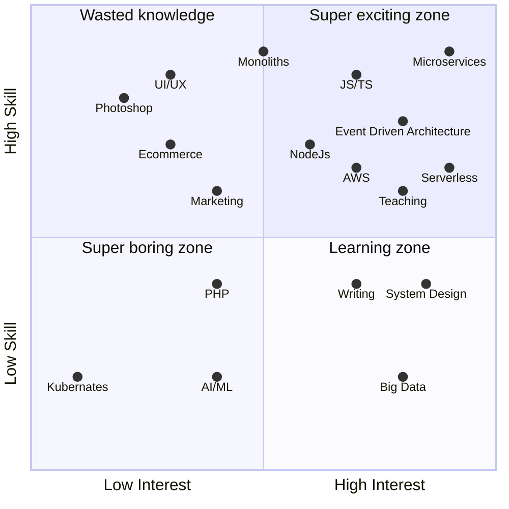
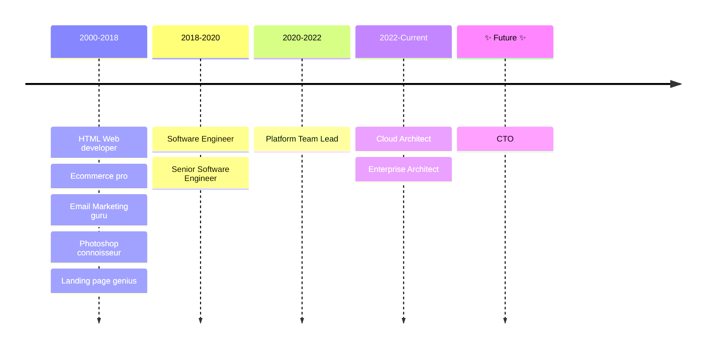

## Lee Nattress

### CONTACT DETAILS
- Email leenattress1981@gmail.com
- LinkedIn [https://linkedin.com/in/leenattress/](https://linkedin.com/in/leenattress/)

## PERSONAL STATEMENT

- I am a CTO / Cloud Architect with a special focus on Serverless Microservice Architecture. I have 20+ years of experience writing software that scales in production.
- I specialize in taking huge monoliths and breaking them down into decoupled microservices, as well as writing advanced tooling and bringing engineers along on the journey to get us to the value quicker.
- I have a full stack of knowledge, including DevOps skills, such as pipelines and actions, automated deployments, bash scripting, and I'm an expert JavaScript serverless framework engineer.
- I come from a technical engineering background, which means I can develop NodeJS backend applications and any JavaScript frontend applications, with full test suites, unit, integration, and end-to-end from first commit to deployment to production. I can pick up any language and framework quickly.
- As for leadership, I have done many talks about development and being an engineer, I write effective documentation for my teams, and I encourage them to do the same. I align teams and technology. I understand how to get the best from engineers and I encourage that process.
- I write video games and love sci-fi, anything that has spaceships, robots, and laser beams. I read a LOT of books; I loved the 'Phoenix Project', 'Domain Driven Design', 'Modern Software Engineering', and 'Accelerate'. I build things with Arduinos and I own far too many soldering irons.

## SKILLS
- Cutting through the noise and getting things done.
- AWS Cloud, operation, and usage.
- AWS Well-Architected Framework
- True event-driven microservices
- Deep knowledge of AWS Serverless offerings and how to use them
- Clear understanding of how to make a platform scale
- How to keep a platform decoupled to allow velocity and parallel development.
- Leading and teaching people how to build the right thing for the business.

## WORK HISTORY

> June 2022 - current

### Cloud Architect - 3t Digital, Gateshead

- Helped move the organization from project-based to product-based delivery.
- Influenced an entire organization to move towards true event-driven microservices in an event-driven environment.
- Architected and built a data ingest pipeline for high scale/volume event-driven imports from customer data into the platform.
- Architected and built a parquet-based export solution so that each customer can access their living data in Power BI.
- Broke down their existing monolithic architecture using domain-driven design.
- Ran Event storming sessions to help us find the seams and properly structure our domains.
- Trained and guided multiple teams, and their leads in the least worst way to build decoupled, distributed systems that scale.
- Educated testing teams on the best ways to build event-driven integration tests.
- Helped the platform team to design and implement any cross-cutting concerns, such as authentication and alerts.
- Gave the product and sales teams ways they can deliver their features sooner by highlighting agile, and then delivering on those promises.
- Worked directly with clients to solve complex integrations, sometimes over-delivering with respect to real-time updates between systems.
- Worked closely with the Head of Development and the CTO daily to deliver large client tenders early.
- Got deep into the code and created multiple frameworks, pieces of tooling, templates, and other velocity multipliers, some of which are now open source.
- Created a mono-repo to develop and deliver microservices, complete with appropriate tooling to deliver services to production, with unit, integration, and end-to-end testing.
- Created documentation for multiple facets of the platform, including event contracts for inter-service communication and fostering proper documentation for any spin-offs and other services.
- Did talks, learning lunches, and hosted think-tanks to ensure we are all on the same page.

### Architect - Workcast, Gateshead

> December 2020 - June 2022

- Architected a serverless broadcasting and streaming system for webinars in AWS using the same technology as Twitch.
- Created a digital stage, where clients could plan and deliver webinars to the broadcast system.
- Created a web browser-based video editor, to edit broadcast content. Moved their deployments from monthly to daily.
- Introduced and championed automated testing.
- Completed multiple software projects with strict goals to receive grants on behalf of the company.
- Multiple talks on behalf of the company, at events such as Serverless North East.

### Senior Software Engineer - Leighton, Gateshead

> March 2018 - December 2020

- Full Stack engineer with functional, security, and penetration testing.
- Worked with teams of professionals to deliver very high-quality software.
- Built auto-scaling REST API in AWS with containers. Built Angular front ends for complex business logic.
- DevOps experience with pipelines and advanced BASH scripting.
- Heavy focus on automation and tooling.

### Various other contributing roles

> ~2000 - 2018

- Ecommerce specialist for several multi-million pound online stores.
- Paid search and social advertising expert with analytics dashboards and conversion metrics for ecommerce.
- Photoshop expert with the ability to handle all features of Photoshop and Illustrator.
- Email marketing, conversion rate testing, and design.
- Landing page design and conversion expert with split testing and analytics, for retail and SaaS products.
- UI/UX design for design systems, admin portals, and SaaS applications.
- Building Intranets for internal data sharing.

## 💥 Skills Scattershot

## 📆 Professional Roles Timeline

## Projects

- https://eventdriven.tools - Think POSTMAN for AWS Events
