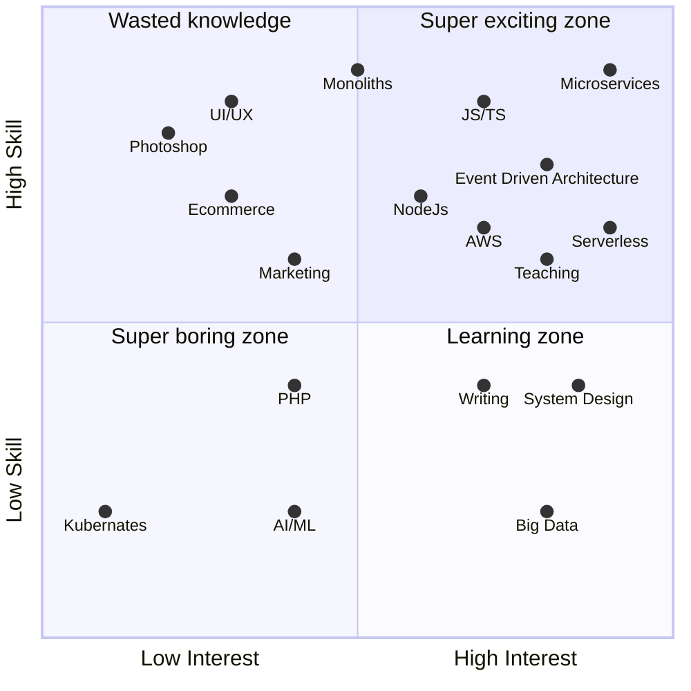
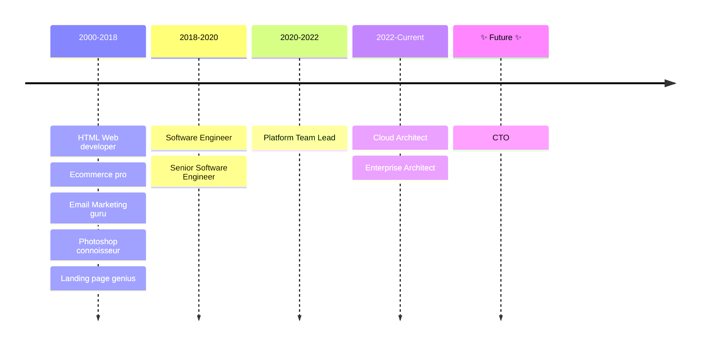

# Lee Nattress

## 🚀 What I'm good at

- Cutting the bullshit and getting things done.
- AWS Cloud, operation and usage.
- AWS Well-Architected Framework
- True event-driven microservices
- Deep knowledge of AWS Serverless offerings and how to use them
- A Clear understanding of how to make a platform scale
- How to keep a platform decoupled to allow velocity and parallel development.
- Leading and teaching people how to build the right thing for the business.
- Doing talks to inspire and align

## 💥 Skills Scattershot

## 📆 Professional Roles Timeline

## Projects

- https://eventdriven.tools - Think POSTMAN for AWS Events