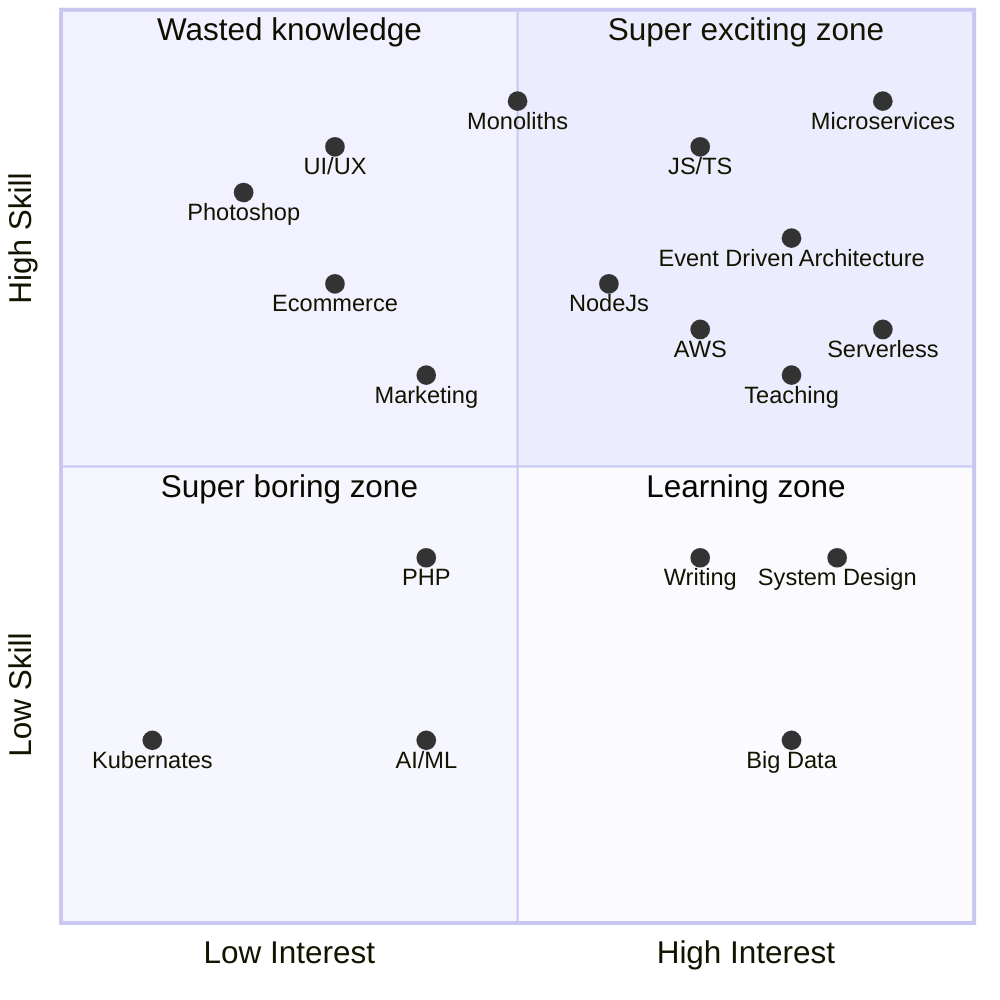
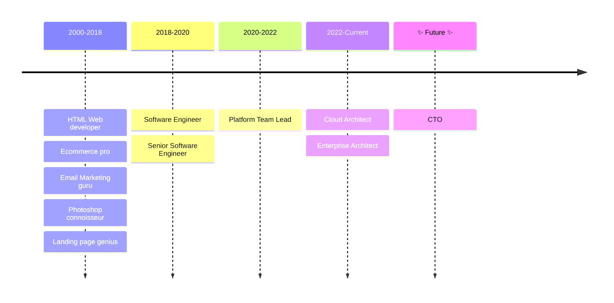

### CONTACT DETAILS

- Email leenattress1981@gmail.com
- LinkedIn [https://linkedin.com/in/leenattress/](https://linkedin.com/in/leenattress/)

## PERSONAL STATEMENT

I am a **Systems and Cloud Architect** with a special focus on **Serverless Microservice Architecture**. I have **25+ years of experience** writing software that scales in production.

I specialize in taking huge monoliths and breaking them down into **decoupled microservices**, as well as writing **advanced tooling** and bringing engineers along on the journey to get us to value faster.

I can also take systems that have become a microservice mess and consolidate them back into **workable, clean monoliths** when that is the right architectural choice for the business.

Along the way to becoming an architect, I have mastered **cloud and serverless platforms** (AWS Lambda, API Gateway, DynamoDB, S3, EventBridge, SQS, SNS, Step Functions, CloudFormation, Azure), **delivery and infrastructure tooling** (Terraform, Docker, CI/CD pipelines, GitHub Actions, Serverless Framework, SAM, CDK), **application engineering** (TypeScript, Node.js, React, Next.js, Python, .NET, PostgreSQL, Redis, WebSockets, REST APIs), and **architecture and quality practices** (Domain-Driven Design, Event Sourcing, CQRS, Test-Driven Development, Infrastructure as Code, Observability with CloudWatch, OWASP, Bash scripting, Git, and Agile methodologies).

I am equally comfortable working **hands-on as a developer** or **leading teams as an architect**. I understand the challenges faced by both roles and can bridge the gap effectively.

I come from a technical engineering background, which means I can develop **NodeJS backend applications** and JavaScript frontend applications, with **full test suites**, unit, integration, and end-to-end from first commit to deployment to production. I can pick up any language and framework quickly.

As for leadership, I have done many talks about development and being an engineer, I write effective documentation for my teams, and I encourage them to do the same. I **align teams and technology**. I understand how to get the best from engineers and I encourage that process.

I write video games and love sci-fi, anything that has spaceships, robots, and laser beams. I read a lot of books; I loved **The Phoenix Project**, **Domain-Driven Design**, **Modern Software Engineering**, and **Accelerate**. I build things with Arduinos and I own *far too many soldering irons*.

## SKILLS

- Cutting through the noise and getting things done.
- AWS Cloud, operation, and usage.
- Azure Cloud architecture and operations.
- Azure DevOps delivery pipelines and platform practices.
- AWS Well-Architected Framework.
- True event-driven microservices.
- Knowing when to build monoliths and when to build microservices.
- Platform architecture and abstraction design (workflows, forms, and shared engineering tooling).
- AI workflows for practical engineering outcomes.
- Secure MCP development patterns and implementation.
- Deep knowledge of AWS Serverless offerings and how to use them.
- Clear understanding of how to make a platform scale.
- How to keep a platform decoupled to allow velocity and parallel development.
- Leading and teaching people how to build the right thing for the business.

## WORK HISTORY

> June 2024 - Current

### Principal Architect - Fairstone, Newcastle

- Scaling a .NET monolith on Azure while keeping it stable and performant.
- Designed and led the consolidation of disconnected systems into a cohesive platform, introducing abstracted workflow and forms tooling to standardize delivery and improve business agility.
- Building features that pass strict regulatory audits for financial services.
- Added AI capability to the platform, with financial and personal data handled securely to the high standards set by the FCA.
- Writing Terraform with automated security checks that catch vulnerabilities before deployment.
- Layering multiple security controls so if one fails, others catch it.
- Running continuous scans to find and fix security issues before they become problems.
- Keeping customer data completely separate using strict isolation patterns.
- Locking down networks with private endpoints, VNets, and zero-trust principles.
- Responding to security audits and compliance reviews with technical evidence.
- Making architecture decisions that do not sacrifice speed for security.
- Teaching teams to think about security from the first line of code.

> June 2022 - 2024

### Cloud Architect - 3t Digital, Gateshead

- Helped move the organization from project-based to product-based delivery.
- Influenced an entire organization to move towards true event-driven microservices.
- Architected and built a data ingest pipeline for high scale/volume event-driven imports.
- Architected and built a parquet-based export solution for Power BI access.
- Broke down existing monolithic architecture using domain-driven design.
- Ran Event storming sessions to find seams and properly structure domains.
- Trained and guided multiple teams and leads in building decoupled, distributed systems that scale.
- Educated testing teams on event-driven integration tests.
- Helped platform teams design and implement cross-cutting concerns such as authentication and alerts.
- Worked directly with clients to solve complex integrations.
- Created a mono-repo with tooling for microservice delivery and testing.
- Created documentation across the platform, including event contracts for inter-service communication.
- Delivered talks, learning lunches, and think-tanks.

> December 2020 - June 2022

### Architect - Workcast, Gateshead

- Architected a serverless broadcasting and streaming system for webinars in AWS.
- Created a digital stage where clients could plan and deliver webinars.
- Created a web browser-based video editor for broadcast content.
- Moved deployments from monthly to daily.
- Introduced and championed automated testing.
- Completed multiple software projects with strict goals to receive grants on behalf of the company.
- Delivered talks at events such as Serverless North East.

> March 2018 - December 2020

### Senior Software Engineer - Leighton, Gateshead

- Full Stack engineer with functional, security, and penetration testing.
- Worked with teams to deliver very high-quality software.
- Built auto-scaling REST APIs in AWS with containers.
- Built Angular front ends for complex business logic.
- DevOps experience with pipelines and advanced Bash scripting.
- Heavy focus on automation and tooling.

> ~2000 - 2018

### Various other contributing roles

- Ecommerce specialist for several multi-million pound online stores.
- Paid search and social advertising expert with analytics dashboards and conversion metrics for ecommerce.
- Photoshop expert with the ability to handle all features of Photoshop and Illustrator.
- Email marketing, conversion rate testing, and design.
- Landing page design and conversion expert with split testing and analytics for retail and SaaS products.
- UI/UX design for design systems, admin portals, and SaaS applications.
- Building intranets for internal data sharing.

## 💥 Skills Scattershot

```mermaid
quadrantChart
    x-axis Low Interest --> High Interest
    y-axis Low Skill --> High Skill
    quadrant-1 Super exciting zone
    quadrant-2 Wasted knowledge
    quadrant-3 Super boring zone
    quadrant-4 Learning zone
    JS/TS: [0.7, 0.85]
    NodeJs: [0.6, 0.7]
    Monoliths: [0.5, 0.9]
    System Design: [0.85, 0.4]
    Microservices: [0.9, 0.9]
    Event Driven Architecture: [0.8, 0.75]
    Kubernates: [0.1, 0.2]
    Writing: [0.7, 0.4]
    Teaching: [0.8, 0.6]
    PHP: [0.4, 0.4]
    AWS: [0.7, 0.65]
    Serverless: [0.9, 0.65]
    Photoshop: [0.2, 0.8]
    Ecommerce: [0.3, 0.7]
    UI/UX: [0.3, 0.85]
    Marketing: [0.4, 0.6]
    Big Data: [0.8, 0.2]
    AI/ML: [0.4, 0.2]
```

## 📆 Professional Roles Timeline

```mermaid
timeline
    2000-2018    : HTML Web developer
                 : Ecommerce pro
                 : Email Marketing guru
                 : Photoshop connoisseur
                 : Landing page genius
    2018-2020    : Software Engineer
                 : Senior Software Engineer
    2020-2022    : Platform Team Lead
    2022-Current : Cloud Architect
                 : Enterprise Architect
    ✨ Future ✨  : CTO 

```

## Projects

- https://eventdriven.tools - Think POSTMAN for AWS Events
